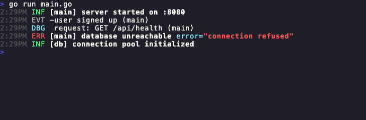

# go-logger

A structured logging package for Go built on [zerolog](https://github.com/rs/zerolog). It provides a simple interface with scoped loggers, colored console output, optional file logging, and a custom Event level for domain-significant occurrences.



## Install

```sh
go get github.com/AquiGorka/go-logger
```

## Usage

```go
package main

import (
	"errors"

	logger "github.com/AquiGorka/go-logger"
)

func main() {
	l, err := logger.New(logger.LevelInfo)
	if err != nil {
		panic(err)
	}

	l.Info("server started on :8080")
	l.Event("user signed up")
	l.Debug("request", "GET /api/health")
	l.Error(errors.New("connection refused"), "database unreachable")

	// Scoped loggers carry a name for context
	db := l.Scope("db")
	db.Info("connection pool initialized")
}
```

### Log levels

| Level | Description |
|---|---|
| `LevelDebug` | Logs everything |
| `LevelInfo` | Info, events, warnings, and errors |
| `LevelEvent` | Events, warnings, and errors |
| `LevelDisabled` | Silences all output |

Levels can be set from configuration strings using `ParseLevel`:

```go
l, err := logger.New(logger.ParseLevel(os.Getenv("LOG_LEVEL")))
```

### File logging

File logging is opt-in. Parent directories are created automatically.

```go
l, err := logger.New(logger.LevelInfo, logger.WithFile("logs/app.log"))
```

### Custom writer

Use `WithWriter` to redirect console output (useful for testing or custom destinations):

```go
var buf bytes.Buffer
l, err := logger.New(logger.LevelInfo, logger.WithWriter(&buf))
```

### No-op logger

For tests or anywhere logging should be silenced:

```go
l := logger.NewNoop()
```

## License

[MIT](LICENSE)
